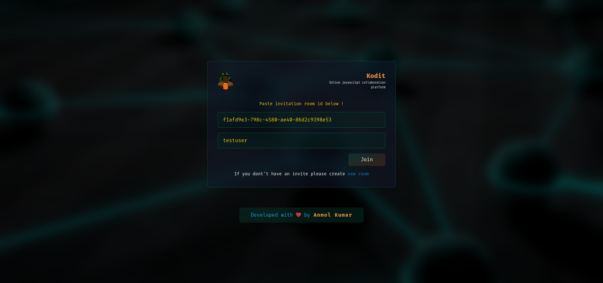
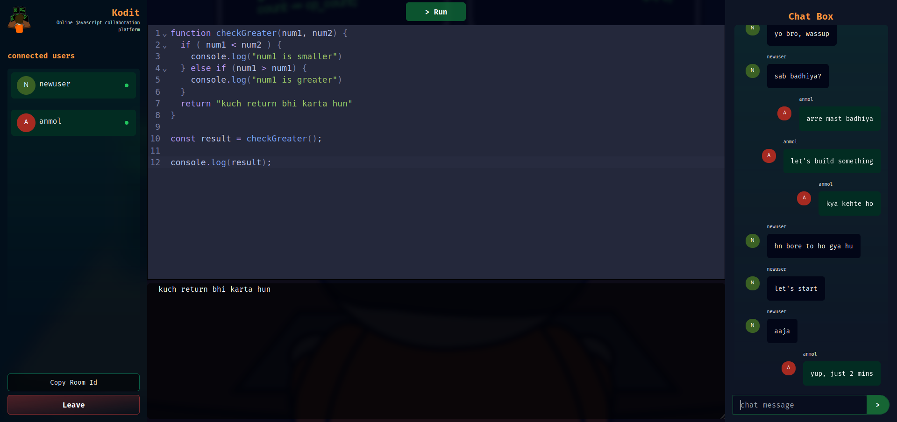

# Kodit
### Online JavaScript Code Collaborator


Online JavaScript Code Collaborator is a real-time code collaboration tool that allows multiple users to join a room and write, edit, and run JavaScript code live. It also includes a real-time chat feature where users can discuss their code and learnings.

This project is built with Vite-React for the frontend and Express.js for the backend. It is currently deployed on Vercel.

### Login page


### Home page


## Features

- Real-time code collaboration
- Real-time messaging/chatting
- Support for multiple users in a single room

## Upcoming Features

- Support for additional programming languages such as Java, Python, and C++
- User profile for data record

## Live Demo

You can check out the live demo of the application here: [Deployed Link](https://kodit.vercel.app/)

## Repository

The code for this project is available on GitHub. You can check it out here: [Repo Link](https://github.com/AnmolDotX/kodit)

## Getting Started

To get a local copy up and running, follow these steps:

1. Clone the repository:


```bash
git clone https://github.com/AnmolDotX/kodit
```
2. Install the dependencies
```bash
    npm install
```
3. Start the developement server
```bash
    npm run dev
```